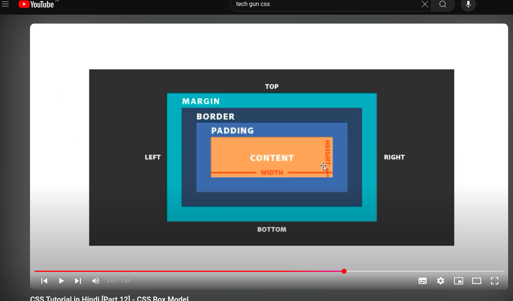

When you set the width and height properties of an element with CSS, you just set
the width and height of the content area. To calculate the full size of an element,

you must also add padding, borders and margins.

• Total element width = width + left padding + right padding + left
border + right border + left margin + right margin

• Total element height = height + top padding + bottom padding + top
border + bottom border + top margin + bottom margin
